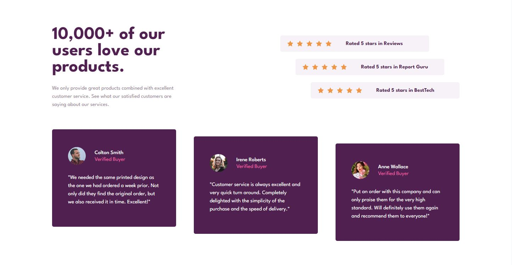
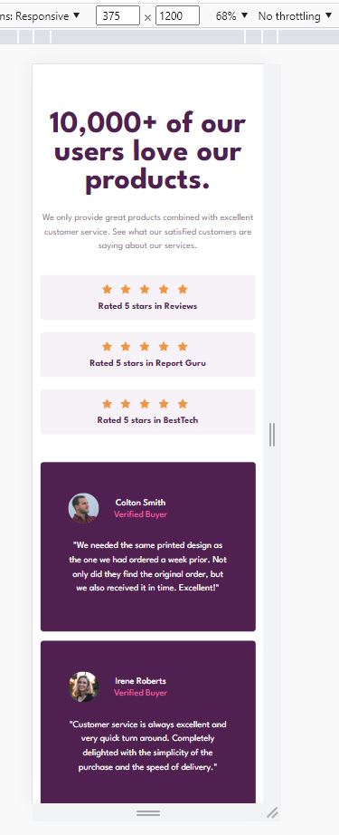

# Frontend Mentor - Social proof section solution

This is a solution to the [Social proof section challenge on Frontend Mentor](https://www.frontendmentor.io/challenges/social-proof-section-6e0qTv_bA). Frontend Mentor challenges help you improve your coding skills by building realistic projects.

## Table of contents

- [Overview](#overview)

  - [The challenge](#the-challenge)
  - [Screenshot](#screenshot)
  - [Links](#Links)
  - [Feedback](#Feedback)
  - [Built with](#built-with)
  - [What I learned](#what-i-learned)
  - [Continued development](#continued-development)

## Overview

Replicated challenge without art files and optimized for screen sizes 1444px and 375px only as per challenge. I will be modifying the code to
fit on all screen sizes in future updates.

### Screenshot

### Links

- Solution URL: [Repository on GitHub](https://github.com/Roneeey/NFTCardPre)
- Live Site URL: [Live site on GitHub Pages](https://roneeey.github.io/NFTCardPre/)

### Feedback

How can I improve on using HTML semantics?

### Built with

- HTML
- CSS
- Flexbox
- Media query

### What I learned

Further knowledge of flexbox and media queries. I will like to learn to use psuedo elements for the star icons.

### Continued development

Using psuedo elements for star icons and to be viewable on any screensize.
